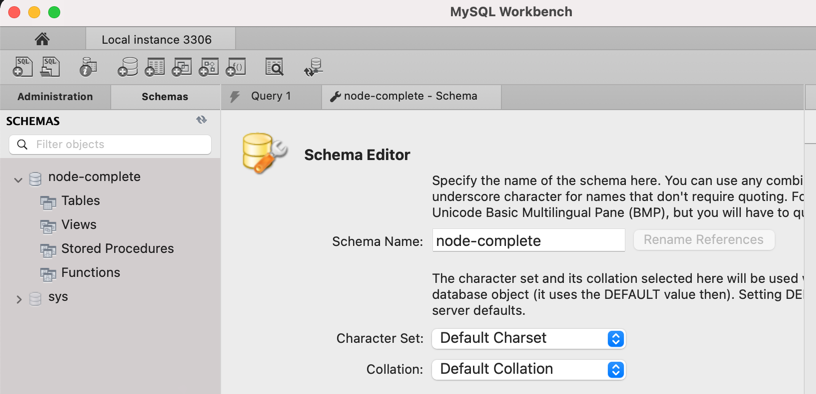

# Section 10. SQL introduction

## NoSQL Introduction
We don't set relations between collections, just duplicate data and change data everywhere  

## Setting Up MySQL

https://dev.mysql.com/downloads/

download:
- mySQL community server
- mySQL workbench

Open workbench - app is running  
schemas => rc 'create new scheme' => apply  



## Connecting our App to the SQL Database

`npm i --save mysql2`

we'll create connection pool  
create file:  
_max-node/util/database.js_  
```js
const mysql = require('mysql2');

const pool = mysql.createPool({
  host: 'localhost',
  user: 'root',
  database: 'node-complete',
  password: 'some_password'
})

module.exports = pool.promise();
```

_max-node/app.js_  
```js
db.execute(`SELECT * FROM products`)
  .then((result) => {
    console.log(result);
  })
  .catch((err) => {
    console.log(err)
  });
```


## Basic SQL & Creating a Table


## Retrieving Data


## Fetching Products

